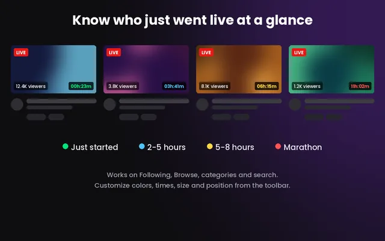
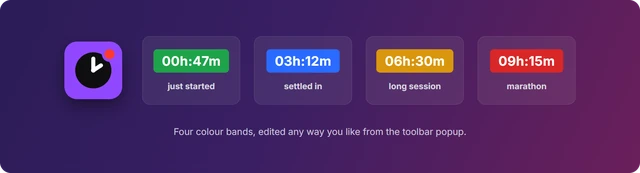

# Uptime Badges for Twitch

**Twitch tells you a channel is live. It doesn't tell you whether the stream
started four minutes ago or nine hours ago.**

This extension adds that missing number: a small timer on every live thumbnail,
colour-coded so you can read the whole page at a glance — who just went live,
and who's deep into a marathon.

<b>Design illustration</b> — how the badges sit on channel cards, next to
Twitch's own viewer count. The cards here are mockups, not a capture of a live
Twitch page.

---

## What it does

- Adds an uptime badge to live channel thumbnails across `twitch.tv` — your
  Following page, Browse, category pages and search results
- The badge shows elapsed broadcast time as `04h:12m`, refreshed every 30 seconds
- Colour tells you the length of the session without reading the number
- Badges disappear on their own when a stream ends
- On a channel's own page no badge is drawn, because Twitch already shows a
  session timer in the player bar

## Badge colours

<b>Promotional artwork</b> — the four default colour bands.

| Colour | Default range | Meaning |
| --- | --- | --- |
| 🟢 Green | under 2 hours | just started |
| 🔵 Blue | 2–5 hours | settled in |
| 🟡 Yellow | 5–8 hours | long session |
| 🔴 Red | 8 hours and up | marathon |

All three cut-off points are editable, so "marathon" can mean whatever you want
it to mean.

## Settings

Everything lives in the toolbar popup — click the extension icon.

- **Show badges** — master on/off switch
- **Colour by uptime** — turn colour coding off for plain white badges
- **Sidebar times** — add compact times to the left-hand channel list too
  (off by default)
- **Size** — scale the badge from 60% to 160%
- **Position** — bottom right, bottom left, top right or top left of the thumbnail
- **Options** — set your own hour thresholds for the three colour changes

Changes apply immediately, with no page reload.

## Install

### From the Chrome Web Store — recommended

**Not published yet.** A Web Store listing is on the way; once it's live this
will be the right way to install for everyone who isn't editing the code,
because updates then arrive automatically. Until then, use the developer
instructions below.

### Load unpacked — for developers

> **This path is for people who want to run or modify the source.**
> It doesn't auto-update, and Chrome will show a "developer mode extensions"
> warning on every startup. If you just want to use the extension, wait for the
> Web Store release above.

1. Download or clone this repository
2. Open Chrome and go to `chrome://extensions`
3. Turn on **Developer mode** (top-right toggle)
4. Click **Load unpacked**
5. Select this project folder (the one containing `manifest.json`)

The extension will appear in your extensions list and toolbar. After changing
any code, return to `chrome://extensions` and click the refresh icon on the
extension's card to reload it.

## Connecting your Twitch account

**Badges stay hidden until you connect a Twitch account.** This is a one-time
standard Twitch login, and it's a requirement of Twitch's API rather than a
choice — the Helix endpoint that reports who is live, and when they started,
only answers authenticated requests.

The extension asks for a single read-only scope (`user:read:follows`). It never
sees your password: the login happens on Twitch's own domain, and Twitch hands
back an access token that is stored only in your browser. You can disconnect
from the popup at any time, or revoke access entirely under **Connections** in
your Twitch account settings.

## Permissions

| Permission | Why it's needed |
| --- | --- |
| `identity` | Runs the Twitch login flow and receives the access token |
| `storage` | Saves your settings and token locally in the browser |
| `api.twitch.tv` | Asks which channels are live and when they started |
| `id.twitch.tv` | Handles the login itself |
| `www.twitch.tv` | Lets the badge script run on Twitch pages |

There is no `tabs` permission, no analytics, and no remote code. Channel names
are read from the page you are already looking at, batched, and sent only to
Twitch.

## Privacy

No servers, no tracking, no data collection. The access token and your settings
stay in your browser's local extension storage, and uninstalling removes them.

See **[PRIVACY.md](./PRIVACY.md)** for the full policy.

## Project structure

| File | Role |
| --- | --- |
| `manifest.json` | Extension manifest (Manifest V3) |
| `background.js` | Service worker — Twitch OAuth and batched Helix lookups |
| `content.js` | Injected into `twitch.tv` pages to find cards and draw badges |
| `popup.html` / `popup.js` | Toolbar popup UI (settings) |
| `welcome.html` / `welcome.js` | First-run onboarding page |
| `icons/` | Extension icons |

## How it works

`content.js` collects channel links from the page and hands them to the service
worker, which queries the Twitch Helix `/streams` endpoint in batches of up to
100 logins. Results are cached for five minutes, badged channels are re-checked
every minute so ended streams drop off, and a debounced `MutationObserver`
picks up infinite scroll and single-page navigations.

Badges copy the font and background of Twitch's own viewer-count pill so they
sit naturally on the card, and are written with inline `!important` styles so
page CSS can't restyle or reflow them.

---

Not affiliated with Twitch Interactive, Inc.
